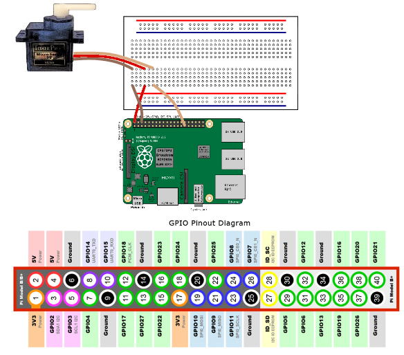

# Servo SG90

## Connections



## Usage

```sh
yarn install
sudo node index.js
```

When REPL is ready you can use functions like these:

```sh
servo.max()
```

```sh
servo.min()
```

```sh
servo.sweep()
```

```sh
servo.stop()
```
