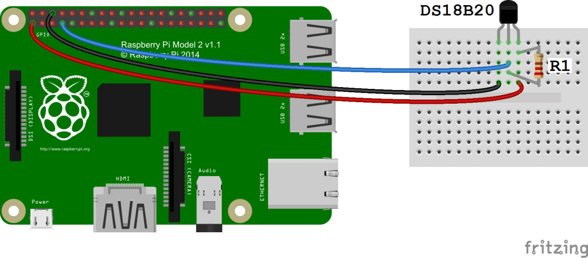

# Temperature sensor

## Enable 1-Wire Interface

```sh
sudo raspi-config
```

Go to `Interface settings`
Go to 1-Wire
Activate by clicking Yes
Ok to confirm
Ok to reboot


## Connections



Use 4.7K Ohm or 10K Ohm resistor!

## Usage

Run `node install`
Run `node index.js`
